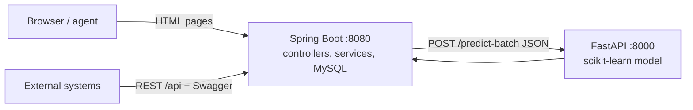

# Engage Customer Retention Platform (ECRP)

A churn prediction and retention platform for telecom companies. A company uploads its
customer data, a machine-learning model scores every customer's churn risk, and a dashboard
surfaces the at-risk list where an agent reviews each flagged customer and takes retention
action.

> Status: working proof of concept. The Spring module is named `springpoc` deliberately —
> the project is being built toward a full, AWS-deployed application.

## Architecture

Two services around one database:



- **Spring Boot (`springpoc/`, :8080)** — owns customer data, the scoring workflow, and the
  Thymeleaf UI. Also exposes a JSON REST API (`/api`) documented with Swagger.
- **FastAPI ML service (`ml-service/`, :8000)** — serves the scikit-learn churn model over
  HTTP with request validation and batch scoring.
- **MySQL** — stores uploaded customers and their prediction results.

The two talk over HTTP/JSON, so either side can be developed, retrained, or deployed
independently.

## Repository layout

```
├── ml-service/          Python: model training + FastAPI serving
│   ├── train.py             trains and selects the model
│   ├── app.py               FastAPI service (/predict, /predict-batch, /health)
│   ├── churn_model.joblib   trained pipeline
│   ├── model_meta.json      model version + metrics
│   ├── requirements.txt
│   └── *.csv                training data + demo upload file
├── springpoc/           Spring Boot application (Java 17, Maven)
├── database/            MySQL schema + user setup script
├── docs/
│   └── MODEL.md         detailed model documentation
└── README.md
```

## Tech stack

Java 17 · Spring Boot 4 · Spring Data JPA · Thymeleaf · MySQL · springdoc-openapi (Swagger) ·
Python 3.12 · FastAPI · scikit-learn · pandas.

## Prerequisites

- Java 17+ and Maven
- Python 3.12+
- MySQL Server + Workbench

## Setup & run

**1. Database** — in MySQL Workbench, open and run `database/churnpredictor-setup.sql`
(edit the placeholder password first). This creates the `churnpredictor` database, user, and
tables.

**2. Spring config** — copy the example properties and set your DB password:

```
springpoc/src/main/resources/application.properties.example
   -> application.properties   (fill in spring.datasource.password)
```

**3. ML service:**

```bash
cd ml-service
pip install -r requirements.txt
python train.py            # trains churn_model.joblib (a few seconds)
uvicorn app:app --port 8000
```

**4. Spring app:**

```bash
cd springpoc
mvn spring-boot:run
```

**5. Open** http://localhost:8080/ — you land on the upload page when the database is empty,
otherwise on the dashboard. A ready-made demo file is at `ml-service/dummy-customers.csv`
(38 valid rows + 2 intentionally invalid, to show upload validation).

## Features

- CSV upload with row-level validation and a load receipt (received / loaded / skipped with
  reasons); a new upload replaces the current dataset.
- Automatic churn scoring after upload via a single batch call to the ML service.
- Dashboard: risk summary cards, risk-band filter tabs, server-side pagination, per-customer
  action status.
- Per-customer review page: full profile, churn probability, the reasons the customer was
  flagged, and an unflag action.
- Graceful degradation and input validation on both services.

## API documentation

A static REST API reference is in [docs/API.md](docs/API.md). With the app running,
interactive docs are also available at:

- **Swagger UI:** http://localhost:8080/swagger-ui/index.html
- **ML service (FastAPI) docs:** http://localhost:8000/docs

## Model

The churn model (feature set, preprocessing, model selection, metrics, and serving) is
documented in full in [docs/MODEL.md](docs/MODEL.md).

## Roadmap

Planned integrations (LLM-assisted retention workflow, model retraining, security, cloud
deployment) are described in [docs/ROADMAP.md](docs/ROADMAP.md).
